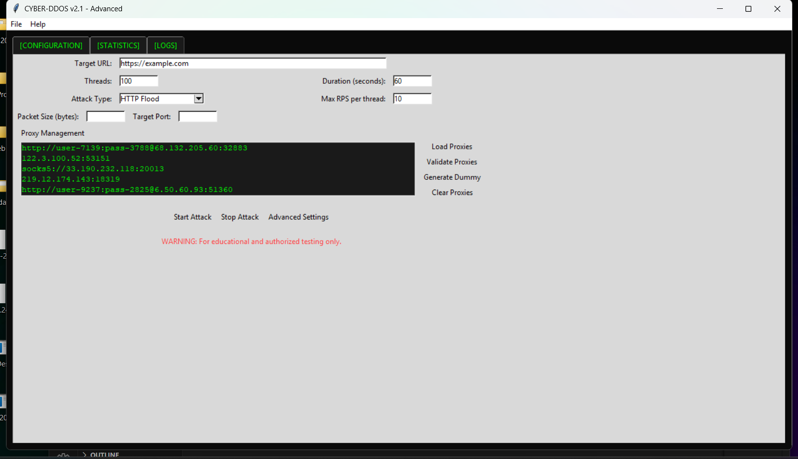

# CYBER-DDOS v2.1 - Advanced Traffic Generator



**Developer**: Shiboshree Roy  
**Warning**: For educational and authorized testing purposes only. Unauthorized use is strictly prohibited.

## Features

- 🎛️ **Multi-Attack Vector Support**
  - HTTP Flood
  - Slowloris (Low-and-Slow attack)
  - UDP Flood
- 🔄 **Proxy Management**
  - Load/validate proxy lists
  - Auto-generate dummy proxies
  - Rotating proxy support
- 📊 **Real-Time Monitoring**
  - Interactive RPS (Requests Per Second) graph
  - Comprehensive statistics dashboard
  - Detailed event logging system
- ⚙️ **Configuration Management**
  - Save/load attack profiles
  - Customizable attack parameters
  - Multi-threading control
- 🖥️ **Hacker Theme GUI**
  - Dark interface with neon accents
  - Tabbed navigation system
  - Responsive status updates

## Installation

1. **Requirements**
   - Python 3.6+
   - Required packages:
     ```bash
     pip install requests matplotlib tkinter
     ```

2. **Download**
   ```bash
   git clone https://github.com/shiboshreeroy/cyber-ddos.git
   cd cyber-ddos
   ```

## Usage

```bash
python cyberdoss.py
```
### Or 
---
## 📦 Download for windows 

👉 [Click here to download the game for Windows](./dist/cyberdoss.exe)
### GUI Overview

1. **Configuration Tab**
   - Set target URL and attack parameters
   - Configure threads, duration, and attack type
   - Manage proxy lists (import/validate/generate)

2. **Statistics Tab**
   - Real-time request metrics
   - Interactive RPS timeline graph
   - Success/error rate monitoring

3. **Logs Tab**
   - Detailed attack chronology
   - Filterable event types (success/errors/warnings)

### Attack Types

- **HTTP Flood**: High-volume GET requests with header spoofing
- **Slowloris**: Persistent connections with partial headers
- **UDP Flood**: Custom packet size/port configuration

## Configuration Parameters

| Parameter          | Description                              | Default       |
|--------------------|------------------------------------------|---------------|
| Target URL         | Full HTTP(S) URL to target               | Required      |
| Threads            | Concurrent attack threads                | 100           |
| Duration           | Attack duration in seconds (0=infinite)  | 60            |
| Max RPS/Thread     | Requests per second limit per thread     | 10            |
| UDP Packet Size    | Data payload size in bytes               | 1024          |
| UDP Target Port    | Specific port for UDP flood              | Random        |

## Proxy Management

1. Load proxies from text file (IP:PORT format)
2. Validate working proxies
3. Generate dummy proxies for testing
4. Automatic proxy rotation during attacks

## Ethical Disclaimer

⚠️ **This software must only be used for**:  
- Authorized penetration testing  
- Educational purposes  
- Security research with explicit permission  

**The developer assumes no liability for misuse of this tool.**  
**Unauthorized network attacks are illegal under cybercrime laws worldwide.**

## License

MIT License - See [LICENSE](LICENSE) file for details
